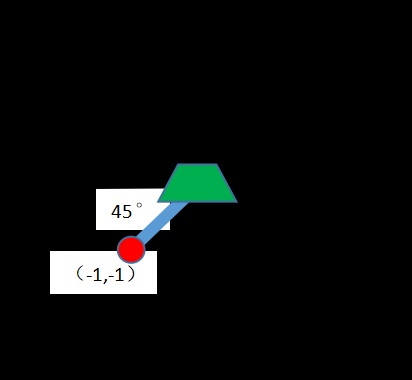
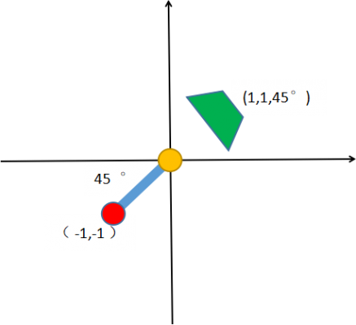
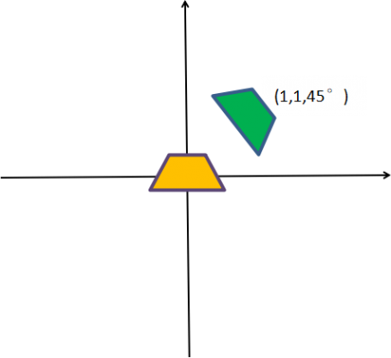
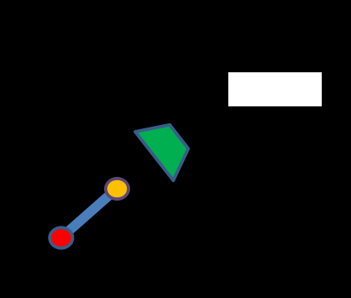
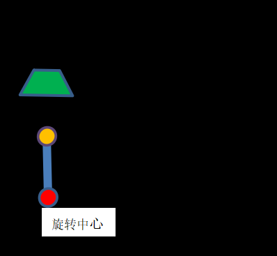
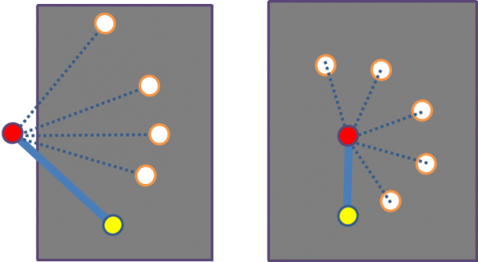
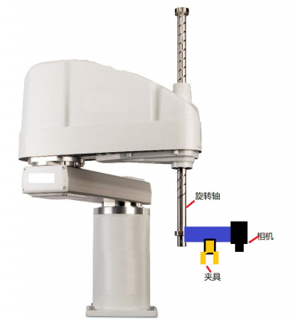
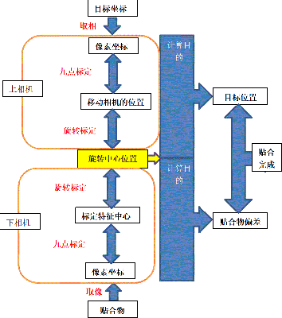
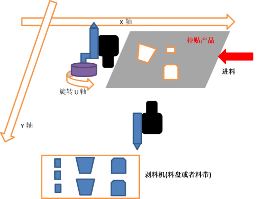
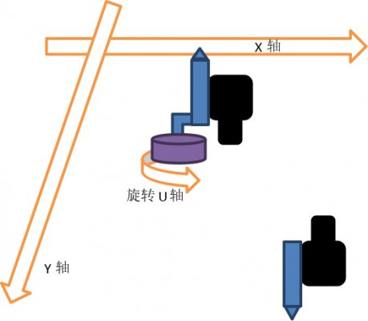

# Halcon 学习笔记

## 算子

- `connection(Region, ConnectedRegions)`
将不相连的区域都分割成单独的区域

## 2D视觉算法流程

采集 => 预处理 => 分割 => 识别 => 通讯

## 连接相机

### 实现方式

#### 循环采集

#### 定时器

#### 多线程

#### 回调函数

### Halcon 助手

## 项目案例

### 上下双相机贴合定位

[Halcon学习网-上下双相机定位贴合](http://www.ihalcon.com/read-14507.html)

#### 标定

这一小节总结了通用的相机和轴的相对位置模型，并对其标定进行详细讲解。

##### 九点标定

本质就是**仿射变换**，从一个坐标系转换到另一个坐标系。最少三个不同线的点，标定就有一定的拟合作用,能够减少一部分由于畸变带来的误差。

核心Halcon算子：`vector_to_hom_mat2d`

##### 标定模型1：相机固定（眼在手外），夹具无旋转 

相机固定，夹具不旋转。

- 夹具夹取产品或者标定块，选取一个特征，开始进行标定
- X轴、Y轴移动一个位置，记录轴的物理坐标：（Qx1,Qy1）
- 提取图像中对应特征点，图像像素坐标:（Px1,Py1）
- ......
- 运动第N位置，记录下点位轴轴坐标（QxN,QyN），像素坐标：（PxN,PyN）

一般9点、16点，特征均匀分布在图像的各个位置即可。

把上面记录的点转化成halcon的使用的方式，如下：

```
Px:=[1,2,3]
Py:=[1,2,3]
Qx:=[3,9,12]
Qy:=[3,9,12]
vector_to_hom_mat2d (Px, Py, Qx , Qy, HomMat2D)
```

HomMat2D就是得到矩阵.

**注意：**这里选取特征进行标定的方式，用到的像素坐标是特征点的位置，而记录的物理坐标是轴的位置，大部分情况下轴的中心点和特征点并不重合。

这里实际上是以**特征点的像素坐标**对应**轴的物理坐标**来做标定，这样得到的结果似乎不正确，但由于特征点的物理坐标和轴的物理坐标都是在机械臂的坐标系下的，因此使用上述得到的变换矩阵`HomMat2D`将特征点的像素坐标转换成的物理坐标与实际特征点的物理坐标而言只是平移了一段距离（夹具上的特征点到轴中心的向量），而正是因为有这个偏移，图像上像素坐标转换的物理坐标就变成了轴的物理坐标。

也就是说，在此标定模型下，我们用**特征点的像素坐标**对应**轴的物理坐标**来做标定能够得到想要的结果。在夹具无旋转的情况下一切都很顺利，但是如果夹具需要旋转抓取（大部分情况下是这样），就会出现问题，这一点后面会讲。

##### 标定模型2：相机移动（眼在手上），无旋转

相机固定到轴上，不能旋转，这种是大部分设备的移动相机的模式。

- 标定时，把标定特征的产品或者标定块放在相机下方位置固定不动
- 移动相机（即移动轴），每走一个点，记录下
  - 点位轴坐标（QxN,QyN），
  - 像素坐标：（PxN,PyN）

把上面记录的点转化成halcon的使用的方式，如下：

```
Px:=[1,2,3]
Py:=[1,2,3]
Qx:=[3,9,12]
Qy:=[3,9,12]
vector_to_hom_mat2d (Px, Py, Qx , Qy, HomMat2D)
```

HomMat2D就是得到矩阵，注意虽然计算过程和模型A一模一样，但是矩阵的使用是不相同，后面会有说明。

标定模型2的相机和夹具的位置关系是固定不变的，存在一个固定的机械偏差（Mx,My）。

要计算这个偏差，有两个方法。

方法1：可以先让夹具中心对位标定块，记录下此时的机械坐标，然后水平移动机械臂让标定块位于上相机的图像中心，记录下此时的机械坐标，这样就可以计算出这个固定偏差（Mx,My）。

方法2：如果夹具中心对位标定块时，标定块在上相机视野范围内，也可以记录标定块此时和在画面中心时的像素位置，通过变换矩阵得到两个位置的物理坐标，以此计算固定偏差（Mx,My）。

将方法1和方法2的结果做对比，也可以评估我们的标定是否准确。

##### 标定模型3：相机固定（眼在手外），夹具旋转

实际固定相机的项目，基本上夹具都是可以旋转的，因为我们去夹取的产品肯定有角度偏差，然后通过下方固定相机的拍照，补偿贴合，这也是固定相机意义所在。

涉及旋转必须进行旋转标定，不然每次贴合总会带有旋转产生的误差。

实际项目中，训练好后，我们就会手动移动轴或者机械手到要放的位置，这就是示教一个标准放置位置M1（x,y,u）（x/y轴坐标值，旋转轴U轴值，后面会用到，记住），然后就是抓取产品拍照，补偿贴合。



所以当前模板产品位置的偏差(0,0,0)。

当我们的抓取的一个待放的产品时，它此时的位置可能和我们示教产品的位置不同，这里相当于匹配中心，偏移了（1,1,），旋转了45度， 如下图：



同时注意产品是夹具抓取的，所以旋转轴、夹具、产品是一体，旋转和平移都是一体进行的。

假设我们上面的产品没有偏差，直接把产品移动到我们的目标位置：标准放置位置M1（x,y,u），放下产品，如下图。这样我们就知道该怎样旋转平移了。



黄色表示标准位置，绿色表示当前产品位置，但是一定要明确上面的图是在我们产品放置位置俯视产生的，所以这个补偿（Dx,Dy,Du）只要直接叠加到M1（x,y,u）上，即得到我们最终的运动位置M2（x+Dx,y+Dy,u+Du），轴或者机器人直接运动到这个位置，放下产品即可。

固定的下相机，它的作用是通过计算得一个偏差，而不是绝对位置；而绝对贴合的位置是由其他相机或者示教等等产生的，合在一起就组成一个完整补偿。

我们只要绿色产品位置移动到黄色位置即可，流程如下：

第一步：移动产品产生的偏差（1,1）：



红色旋转中心坐标就变成了(-2,-2)，绿色产品中心（0,0）

第二步：旋转角度45°，一定记住旋转中心在红色圆圈



可以看出，经过平移和旋转并不能把产品移动到目标位置，发现还差一个偏差（-2，2√2-2）（就是旋转后坐标减去旋转前坐标）。

同时，一定要注意在我们计算这个偏差的时候，我们用到了旋转中心的坐标；但是我们在做九点校正的时候，标定的基准是标定特征的中心，而不是旋转中心，实际项目中我们夹具抓取标定块进行标定，根本做不到把旋转中心和标定特征的中心重合，所以我们就需要通过旋转标定找到旋转中心并消除它。

通过以上分析了解了背后原理和标定目标，下面我们开始标定。

**九点标定**

这里九点标定就变成了标定模型1，得到一个矩阵HomMat2D。

**旋转标定**

首先选择适当夹具角度，利于我们在定点旋转时，能够旋转更大的角度。因为旋转标定其实就是定点旋转标定特征，然后拟合找圆心，点分布的角度越大，精度越高。200°旋转效果已经非常好了，很多时候因为视野和机构问题，能到达90°就已经可以了。



计算过程如下：
- 记录当前物理点P1（x,y），此为定点，因为整个过程机械臂不动，只有夹具旋转；
- 选取夹具上标定块目标特征，记录特征中心的像素为(Prx1,Pry1）；
- 旋转一个小角度，提取特征中心的像素为(Prx2,Pry2）；
- .....
- 旋转到第N个点，提取特征中心的像素为(PrxN,PryN）。

旋转标定的目的是找到夹具的旋转中心。下面我们通过在Halcon中拟合圆来得到它。

首先利用九点标定的变换矩阵求出旋转点像素坐标对应的物理坐标。

```C
*九点标定的矩阵
HomMat2D:=[0.0202215, 3.43298e-005, -27.1543, 3.20314e-005, -0.0202298, 75.8988]
*旋转点集的像素坐标，例如如下
Prx:=[0,1,2,3,4,5,6]
Pry:=[0,1,2,3,4,5,6]
for Index := 0 to |Prx|-1 by 1
   *通过矩阵转换一个点到另一点的算子
   affine_trans_point_2d (HomMat2D, Prx[Index], Pry[Index], Qx, Qy)
   Qrx[Index]:=Qx
   Qry[Index]:=Qy
Endfor
```

然后利用这些机械臂坐标系下的点坐标拟合圆。

```C
*先生成轮廓
gen_contour_polygon_xld (Contour, Qry, Qrx)
*轮廓拟合圆，算法要选择'geotukey'，自己看说明文档
fit_circle_contour_xld (Contour, 'geotukey', -1, 0, 0, 3, 2, Row_C, Column_C, Radius_C, StartPhi, EndPhi, PointOrder)
```

我们得到了旋转中心点的物理坐标，就可以得出特征点到旋转中心的向量，用来消除偏差。

```C
*定点P1
x:=1
y:=1
Dx_C:=Column_C-x
Dy_C:=Row_C-y
```
##### 标定模型4：相机在旋转轴上（眼在手上，可旋转）



该模型的相机安装方式如上图所示。如果我们拍照的时候，保持旋转轴的角度和标定的一致，其实就相当于相机在我们整个过程中是没有旋转的，也就是上面的标定模型2。

**九点标定**

这里的九点标定方法与标定模型2一致。需要注意的是在标定过程中相机不能有旋转。

**旋转标定**

- 调整机械臂到物理点P2（x,y），保持位置不变
- 调整旋转轴，将相机旋转到合适位置
- 相机下方放置一个固定标定特征，然后让旋转轴旋转固定角度后进行拍照。
  - 第一个位置，提取特征中心的像素为(Prx1,Pry1）
  - 旋转一个小角度，提取特征中心的像素为(Prx2,Pry2）
  - .....
  - 旋转到第N个点，提取特征中心的像素为(PrxN,PryN）

求取的固定偏差（Mx,My）

```C
*Halcon计算如下：
*第一步，拟合点计算：
*九点标定的矩阵
HomMat2D:=[0.0202215, 3.43298e-005, -27.1543, 3.20314e-005, -0.0202298, 75.8988]
*旋转点集的像素坐标，例如如下
Prx:=[0,1,2,3,4,5,6]
Pry:=[0,1,2,3,4,5,6]

for Index := 0 to |Prx|-1 by 1
   *通过矩阵转换一个点到另一点的算子
   affine_trans_point_2d (HomMat2D, Prx[Index], Pry[Index], Qx, Qy)
   Qrx[Index]:=Qx
   Qry[Index]:=Qy
Endfor

*已经得到我们的物理的拟合点Qrx, Qry

*第二步，拟合圆：
*拟合圆
*先生成轮廓
gen_contour_polygon_xld (Contour, Qry, Qrx)
*轮廓拟合圆，算法要选择'geotukey'
fit_circle_contour_xld (Contour, 'geotukey', -1, 0, 0, 3, 2, Row_D, Column_D, Radius_D, StartPhi, EndPhi, PointOrder)

*得到圆心（Column_D,Row_D），半径 RadiusD。

*第三步，计算偏差：
*定点P2
x:=1
y:=1
Mx:=Column_D-x
My:=Row_D-y
```

##### 标定结果验证

**九点标定结果验证**

标定完成后，使用计算得到的变换矩阵将图像中心像素坐标转换为物理坐标，输入给机械臂令其移动到这个点，这时标定块中心应该正好位于图像中心。

**旋转标定结果验证**

使用九点标定得到的变换矩阵，将图像中心像素坐标转换为物理坐标，然后再加上旋转标定计算的偏差，得到最后的物理坐标，输入给机械臂令其移动到这个点，这时，
- 对于标定模型3，旋转中心将位于图像中心；
- 对于标定模型4，旋转中心将位于标定块中心。

#### 上下双相机贴合模型

##### 整体框架

我们上面讲的模型C的相机也就是下相机的作用，它是来计算用于贴合或者装配产品的抓取的偏差。

对于目标产品，如果用高精度的定位模具来放置目标产品，这是不需要上相机的。但如果下一个产品进来（皮带轨道传入或者机器手放入），位置和上一次都有一些小的偏差，这样就导致了贴合的目标位置每次有变动，这就需要我们的上相机先计算目标的贴合位置。

总结来说：
- 上相机作用：确定贴合的产品的放置位置
- 下相机作用：确定抓取或者吸取料的偏差值

下图为上下贴合示意图，展示了上下贴合标定和计算的整体思路框架。



在上图中，上下相机有几点不同：

- 上下相机的输入不同：
  - 下相机：用于贴合的产品，
  - 上相机：目标产品的位置。
- 最后标定中心的关系以不同：
  - 下相机：标定特征中心，
  - 上相机：移动相机的物理位置。
- 上下相机的标定得到的转换关系（就是我们标定的转换矩阵）不同：
  - 下相机：贴合物的像素坐标与旋转中心的关系；
  - 上相机：目标贴合位置与旋转中心的关系
- 计算目的不同：
  - 下相机：求取的贴合物的偏差；
  - 上相机：求取的是目标的绝对位置。
  
上下相机关系纽带：旋转中心。



##### 贴合模型（标定模型2+3）



工作流程如下：
- 产品进入当前工位（轨道流入或者机器人抓入）
- X.Y轴移动到剥料机位置，抓取料
- 运动到下相机位置拍照，计算偏差
- X.Y轴运动到贴合位置，加上偏差进行贴料
- 产品离开当前工位，等待下一个产品

>也可以先取料，下相机拍照计算好偏差，然后等待产品流入，上相机拍照，最后进行贴合。


##### 上相机计算贴合位置

- 产品到位，
- XY轴移动到设置好的点M1，物理坐标（x,y），下相机拍照，
- 上相机拍照，视觉匹配处理得到当前产品像素坐标C1（x,y）

标定模型2得到的九点标定矩阵，这里定义为：HomMat2D_2
同时上文还讲到了模型2的上相机的与旋转中心的固定偏差（Mx,My）

通过上面我们就可以计算贴合的位置：

像素坐标转换为物理坐标：

```C
HomMat2D_2:=[0.0202215, 3.43298e-005, -27.1543, 3.20314e-005, -0.0202298, 75.8988]

*当前产品像素坐标C1（x,y）,得转换坐标：QC1（x,y）
Xc1:=2.5
Yc1:=2.5
affine_trans_point_2d (HomMat2D_2, Xc1, Yc1, Qxc1, Qyc1)

*标定的基准点（0,0）,得转换坐标：Base（x,y）
affine_trans_point_2d (HomMat2D_2, 0, 0, Xbase, Ybase)

计算当前点Qup(x,y)：
Qxup=Xm1-Xbase-Qxc1-Mx
Qyup=Ym1-Ybase-Qyc1-My
```


