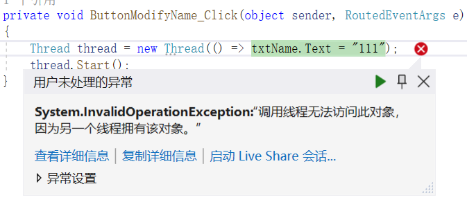

[TOC]

# WPF 学习笔记

## WPF概述

Windows APIWindows Presentation Foundation (WPF) 是下一代显示系统，用于生成能带给用户震撼视觉体验的 Windows 客户端应用程序。WPF 的核心是一个与分辨率无关并且基于矢量的呈现引擎。WPF 提供了一整套应用程序开发功能，包括可扩展应用程序标记语言 (XAML) 、控件 、数据绑定 、布局 、二维和三维图形 、动画 、样式 、模板 、文档 、媒体 、文本和版式。

WPF 作为 .NET 类型的一个子集存在，大部分位于 System.Windows 命名空间中。 如果你曾经使用 ASP.NET 和 Windows 窗体等框架通过 .NET 构建应用程序，应该会熟悉基本的 WPF 编程体验：

- 实例化类
- 设置属性
- 调用方法
- 处理事件

WPF 还包括可增强属性和事件的其他编程构造：依赖项属性和路由事件。

通过 WPF，可以使用标记和隐藏代码开发应用程序，这是 ASP.NET 开发人员已经熟悉的体验。 通常使用 XAML 标记实现应用程序的外观，同时使用托管编程语言（隐藏代码）来实现其行为。 这种外观和行为的分离具有以下优点：

- 降低了开发和维护成本，因为特定于外观的标记与特定于行为的代码不紧密耦合。

- 开发效率更高，因为设计人员在实现应用程序外观的同时，开发人员可以实现应用程序的行为。

- WPF 应用程序的全球化和本地化得以简化。

### XMAL

XAML 是一种基于 XML 的标记（markup）语言，以声明形式实现应用程序的外观。 通常用它定义窗口 、对话框 、页面和用户控件，并填充控件 、形状和图形。

### 隐藏代码

在 WPF 中，在与XAML相关联的代码中实现此行为。 此类代码称为隐藏代码(code-behind)。 

XAML:

```XML
<Window x:Class="WPFLearning.MainWindow"
        xmlns="http://schemas.microsoft.com/winfx/2006/xaml/presentation"
        xmlns:x="http://schemas.microsoft.com/winfx/2006/xaml"
        xmlns:d="http://schemas.microsoft.com/expression/blend/2008"
        xmlns:mc="http://schemas.openxmlformats.org/markup-compatibility/2006"
        xmlns:local="clr-namespace:WPFLearning"
        mc:Ignorable="d"
        Title="WPF学习" Height="245" Width="480" WindowStartupLocation="CenterScreen">
        
        <Button x:Name="btn_helloWPF" Margin="0,5,0,0" Click="Btn_HelloWPF_Click">Click Me</Button>
</Window>
```


隐藏代码:
```CSharp
namespace WPFLearning
{
    /// <summary>
    /// Interaction logic for MainWindow.xaml
    /// </summary>
    public partial class MainWindow : Window
    {
        public MainWindow()
        {
            InitializeComponent();
        }

        private void Btn_HelloWPF_Click(object sender, RoutedEventArgs e)
        {
            MessageBox.Show("Hello WPF!");
        }
    }
}

```

- `x:Class` 用于标记与哪个隐藏代码类（code-behind class）相关联
- 隐藏代码类的构造函数中调用的函数`InitializeComponent()`将`XAML`定义的UI与隐藏代码类整合起来。它是自动生成的，无需手动实现。

### 输入和命令

### WPF控件

按钮： `Button` 和 `RepeatButton。`

数据显示：`DataGrid` 、`ListView` 和 `TreeView`。

日期显示和选项： `Calendar` 和 `DatePicker`。

对话框： `OpenFileDialog` 、 `PrintDialog`和 `SaveFileDialog`。

数字墨迹： `InkCanvas` 和 `InkPresenter`。

文档： `DocumentViewer` 、 `FlowDocumentPageViewer` 、 `FlowDocumentReader` 、 `FlowDocumentScrollViewer`和 `StickyNoteControl`。

输入： `TextBox` 、 `RichTextBox`和 `PasswordBox`。

布局： `Border` 、 `BulletDecorator` 、 `Canvas` 、 `DockPanel` 、 `Expander` 、 `Grid` 、 `GridView` 、 `GridSplitter` 、 `GroupBox` 、 `Panel` 、 `ResizeGrip` 、 `Separator` 、 `ScrollBar` 、 `ScrollViewer` 、 `StackPanel` 、 `Thumb` 、 `Viewbox` 、 `VirtualizingStackPanel` 、 `Window和` `WrapPanel`。

媒体： `Image` 、 `MediaElement` 和 `SoundPlayerAction`。

菜单： `ContextMenu` 、 `Menu` 和 `ToolBar`。

导航： `Frame` 、 `Hyperlink` 、 `Page` 、 `NavigationWindow` 和 `TabControl` 。

选项： `CheckBox` 、 `ComboBox` 、 `ListBox` 、 `RadioButton` 和 `Slider`。

用户信息： `AccessText` 、 `Label` 、 `Popup` 、 `ProgressBar` 、 `StatusBar` 、 `TextBlock` 和 `ToolTip`。

### Layout

创建用户界面时，按照位置和大小排列控件以形成布局。 任何布局的一项关键要求都是适应窗口大小和显示设置的变化。 WPF 为你提供一流的可扩展布局系统，而不强制你编写代码以适应这些情况下的布局。

布局系统的基础是相对定位，这提高了适应不断变化的窗口和显示条件的能力。 该布局系统还可管理控件之间的协商以确定布局。 协商是一个两步过程：首先，控件将需要的位置和大小告知父级。 其次，父级将控件可以有的空间告知控件。

该布局系统通过基 WPF 类公开给子控件。 对于通用的布局（如网格 、堆叠和停靠），WPF 包括若干布局控件：

Canvas：子控件提供其自己的布局。

DockPanel：子控件与面板的边缘对齐。

Grid：子控件由行和列定位。

StackPanel：子控件垂直或水平堆叠。

VirtualizingStackPanel：子控件在水平或垂直的行上虚拟化并排列。

WrapPanel：子控件按从左到右的顺序放置，在当前行上的空间不足时 换行到下一行。

### 数据绑定

大多数应用程序旨在为用户提供查看和编辑数据的方法。 对于 WPF 应用程序，存储和访问数据的工作已由许多不同的 .NET 数据访问库（例如 SQL 和 Entity Framework Core）提供。 访问数据并将数据加载到应用程序的托管对象后，WPF 应用程序的复杂工作开始。 从根本上来说，这涉及到两件事：

- 将数据从托管对象复制到控件，在控件中可以显示和编辑数据。

- 确保使用控件对数据所做的更改将复制回托管对象。

为了简化应用程序开发，WPF 提供了一个强大的数据绑定引擎来自动处理这些步骤。 数据绑定引擎的核心单元是 Binding 类，其工作是将控件（绑定目标）绑定到数据对象（绑定源）。 


WPF 支持直接在 XAML 标记中声明绑定。 例如，下面的 XAML 代码使用`{Binding ... }` XAML 语法将 TextBox 的 Text 属性绑定到对象的 Name 属性。 

```XML
 <Window
     xmlns="http://schemas.microsoft.com/winfx/2006/xaml/presentation"
     xmlns:x="http://schemas.microsoft.com/winfx/2006/xaml"
     x:Class="SDKSample.DataBindingWindow">

   <!-- Bind the TextBox to the data source (TextBox.Text to Person.Name) -->
   <TextBox Name="personNameTextBox" Text="{Binding Path=Name}" />

 </Window>
```

### 内容模型

大多数 WPF 控件的主要用途是显示内容。 在 WPF 中，可以构成控件内容的项的类型和数目称为控件的 内容模型。 某些控件可以包含一种内容类型的一个项。 例如，TextBox 的内容是分配给 Text 属性的一个字符串值。

但是，其他控件可以包含不同内容类型的多个项；Button 的内容（由 Content 属性指定）可以包含各种项，包括布局控件 、文本 、图像和形状。

### 触发器

尽管 XAML 标记的主要用途是实现应用程序的外观，你也可以使用 XAML 来实现应用程序行为的某些方面。 其中一个示例是使用触发器来基于用户交互更改应用程序的外观。

### 模板

WPF 控件的默认用户界面通常是从其他控件和形状构造的。 例如， Button 由 ButtonChrome 和 ContentPresenter 控件组成。 ButtonChrome 提供了标准按钮外观，而 ContentPresenter 显示按钮的内容，正如 Content 属性所指定。

有时，某个控件的默认外观可能与应用程序的整体外观冲突。 在这种情况下，可以使用 ControlTemplate 更改控件的用户界面的外观，而不更改其内容和行为。

### 数据模板

使用控件模板可以指定控件的外观，而使用数据模板则可以指定控件内容的外观。 数据模板经常用于改进绑定数据的显示方式。


上图显示 ListBox 的默认外观，它绑定到 Task 对象的集合，默认时是ListBox的外观。 但是，每个任务的默认外观仅包含任务名称。 若要显示任务名称 、描述和优先级，必须使用 ListBox 更改 DataTemplate控件绑定列表项的默认外观。 下面是一个示例，说明如何应用为 Task 对象创建的数据模板。


ListBox 会保留其行为和整体外观；只有列表框所显示内容的外观发生变化。

### 样式

通过样式功能，开发人员和设计人员能够对其产品的特定外观进行标准化。 WPF 提供了一个强样式模型，其基础是 Style 元素。 样式可以将属性值应用于类型。 引用样式时，可以根据类型将其自动应用于所有对象，或应用于单个对象。 

### 资源

应用程序中的控件应共享相同的外观，它可以包括从字体和背景色到控件模板 、数据模板和样式的所有内容。 你可以对用户界面资源使用 WPF 支持，以将这些资源封装在一个位置以便重复使用。

下面的示例定义 Button 和 Label共享的通用背景色：

```XML
<Window
    xmlns="http://schemas.microsoft.com/winfx/2006/xaml/presentation"
    xmlns:x="http://schemas.microsoft.com/winfx/2006/xaml"
    x:Class="SDKSample.ResourcesWindow"
    Title="Resources Window">

  <!-- Define window-scoped background color resource -->
  <Window.Resources>
    <SolidColorBrush x:Key="defaultBackground" Color="Red" />
  </Window.Resources>

  <!-- Button background is defined by window-scoped resource -->
  <Button Background="{StaticResource defaultBackground}">One Button</Button>

  <!-- Label background is defined by window-scoped resource -->
  <Label Background="{StaticResource defaultBackground}">One Label</Label>
</Window>
```

## 控件

### 布局控件

#### Grid

XAML 中提供的默认布局控件是 `<Grid>` 控件。

通过使用 Grid 控件，可以像定义表一样定义行和列，并将控件置于特定行和列组合的边界内。 你可以将任意数量的子控件或其他布局控件添加到 Grid 中。 例如，你可以在特定的行和列组合中放置另一个 Grid 控件，然后新的 Grid 可以定义更多的行和列，并拥有自己的子级。

`<Grid>` 控件定义控件所在的行和列。 网格始终只声明单行和单列，这意味着默认情况下，网格就是一个单元格。 这并不能让你真正灵活地放置控件。

在添加新的行和列之前，请向 `<Grid>` 元素添加一个新特性：Margin="10"。 这样就可以从窗口中插入网格，使它看起来更漂亮一些。

接下来，定义两行两列，将网格划分为四个单元格：

```XML
<Window x:Class="Names.LayoutStep2"
        xmlns="http://schemas.microsoft.com/winfx/2006/xaml/presentation"
        xmlns:x="http://schemas.microsoft.com/winfx/2006/xaml"
        xmlns:d="http://schemas.microsoft.com/expression/blend/2008"
        xmlns:mc="http://schemas.openxmlformats.org/markup-compatibility/2006"
        xmlns:local="clr-namespace:Names"
        mc:Ignorable="d"
        Title="Names" Height="180" Width="260">
    <Grid Margin="10">
        
        <Grid.RowDefinitions>
            <RowDefinition Height="*" />
            <RowDefinition Height="*" />
        </Grid.RowDefinitions>

        <Grid.ColumnDefinitions>
            <ColumnDefinition Width="*" />
            <ColumnDefinition Width="*" />
        </Grid.ColumnDefinitions>
        
    </Grid>
</Window>

```
<Label>Names</Label> 定义内容 Names。 有些控件知道如何处理内容，有些则不知道。 控件的内容映射到 Content 属性。 通过 XAML 特性语法设置内容时，将使用以下格式：<Label Content="Names" />。 这两种方法可以实现相同的目的，即，将标签内容设置为显示文本 Names。

不过，我们有一个问题，由于标签是自动分配给网格的第一行和第一列的，因此它占据了半个窗口。 对于第一行，我们不需要那么多空间，因为我们只需要在这一行放置标签。 将第一个 <RowDefinition> 的 Height 特性从 * 更改为 Auto。 Auto 值会自动将网格行的大小调整为其内容（在本例中为标签控件）的大小。

### 控件属性

#### WinddowStartUpLocation

窗口打开后所在位置

## 窗口

窗口生存周期：


## 数据绑定

### 什么是数据绑定

数据绑定是在应用 UI 与其显示的数据之间建立连接的过程。 如果绑定具有正确的设置，并且数据提供适当的通知，则在数据更改其值时，绑定到该数据的元素会自动反映更改。 数据绑定还意味着，如果元素中数据的外部表示形式发生更改，则基础数据可以自动进行更新以反映更改。 例如，如果用户编辑 TextBox 元素中的值，则基础数据值会自动更新以反映该更改。

数据绑定的典型用法是将服务器或本地配置数据放置到窗体或其他 UI 控件中。 此概念在 WPF 中得到扩展，包括将大量属性绑定到不同类型的数据源。 在 WPF 中，元素的依赖属性可以绑定到 .NET 对象（包括 ADO.NET 对象或与 Web 服务和 Web 属性关联的对象）和 XML 数据。

### 基本概念

数据绑定 模型


如图所示，数据绑定实质上是绑定目标与绑定源之间的桥梁。 该图演示了以下基本的 WPF 数据绑定概念：

- 通常情况下，每个绑定具有四个组件：
  - 绑定目标对象。
  - 目标属性。
  - 绑定源。
  - 指向绑定源中要使用的值的路径。
- 目标属性必须为依赖属性。
  大多数 UIElement 属性都是依赖属性，而大多数依赖属性（只读属性除外）默认支持数据绑定。 只有从 DependencyObject 派生的类型才能定义依赖项属性。 所有 UIElement 类型从 DependencyObject 派生。
- 绑定源不限于自定义 .NET 对象。
  尽管未在图中显示，但请注意，绑定源对象不限于自定义 .NET 对象。 WPF 数据绑定支持 .NET 对象 、XML 甚至是 XAML 元素对象形式的数据。 例如，绑定源可以是 UIElement 、任何列表对象 、ADO.NET 或 Web 服务对象，或包含 XML 数据的 XmlNode。 
  
#### 数据上下文

当在 XAML 元素上声明数据绑定时，它们会通过查看其直接的 DataContext 属性来解析数据绑定。 数据上下文通常是绑定源值路径评估的绑定源对象。 可以在绑定中重写此行为，并设置特定的绑定源对象值。 如果未设置承载绑定的对象的 DataContext 属性，则将检查父元素的 DataContext 属性，依此类推，直到 XAML 对象树的根。 简而言之，除非在对象上显式设置，否则用于解析绑定的数据上下文将继承自父级。

绑定可以配置为使用特定的对象进行解析，而不是使用数据上下文进行绑定解析。 例如，在将对象的前景色绑定到另一个对象的背景色时，将使用直接指定源对象。 无需数据上下文，因为绑定在这两个对象之间解析。 相反，未绑定到特定源对象的绑定使用数据上下文解析。

当 DataContext 属性发生更改时，重新评估可能会受数据上下文影响的所有绑定。

#### 数据流的方向

正如上图中的箭头所示，绑定的数据流可以从绑定目标流向绑定源（例如，当用户编辑 TextBox 的值时，源值会发生更改）和/或（在绑定源提供正确通知的情况下）从绑定源流向绑定目标（例如，TextBox 内容会随绑定源中的更改而进行更新）。

你可能希望应用允许用户更改数据，然后将该数据传播回源对象。 或者，可能不希望允许用户更新源数据。 可以通过设置 Binding.Mode 来控制数据流。

此图演示了不同类型的数据流：


- 通过 OneWay 绑定，对源属性的更改会自动更新目标属性，但对目标属性的更改不会传播回源属性。 如果绑定的控件为**隐式只读**，则此类型的绑定适用。 
  例如，可能会绑定到股票行情自动收录器这样的源，也可能目标属性没有用于进行更改的控件接口（例如表的数据绑定背景色）。 如果无需监视目标属性的更改，则使用 OneWay 绑定模式可避免 TwoWay 绑定模式的系统开销。
- 通过 TwoWay 绑定，更改源属性或目标属性时会自动更新另一方。 此类型的绑定适用于可编辑窗体或其他完全交互式 UI 方案。 
  大多数属性默认为 OneWay 绑定，但某些依赖属性（通常为用户可编辑控件的属性，例如 `TextBox.Text` 和 `CheckBox.IsChecked`）默认为 TwoWay 绑定。 用于确定依赖属性绑定在默认情况下是单向还是双向的编程方法是：使用 `DependencyProperty.GetMetadata` 获取属性元数据，然后检查 `FrameworkPropertyMetadata.BindsTwoWayByDefault` 属性的布尔值。
- OneWayToSource 绑定与 OneWay 绑定相反；当目标属性更改时，它会更新源属性。 一个示例方案是只需要从 UI 重新计算源值的情况。
- OneTime 绑定未在图中显示，该绑定会使源属性初始化目标属性，但不传播后续更改。 如果数据上下文发生更改，或者数据上下文中的对象发生更改，则更改不会在目标属性中反映。 
  如果适合使用当前状态的快照或数据实际为**静态数据**，则此类型的绑定适合。 如果你想使用源属性中的某个值来**初始化目标属性**，且提前不知道数据上下文，则此类型的绑定也有用。 此模式实质上是 OneWay 绑定的一种简化形式，它在源值不更改的情况下提供更好的性能。

#### 触发源更新的因素

TwoWay 或 OneWayToSource 绑定侦听目标属性中的更改，并将更改传播回源（称为更新源）。 例如，可以编辑文本框的文本以更改基础源值。

但是，在编辑文本时或完成文本编辑后控件失去焦点时，源值是否会更新？ 

`Binding.UpdateSourceTrigger` 属性确定触发源更新的因素。 下图中右箭头的点说明了 `Binding.UpdateSourceTrigger` 属性的角色。


如果 `UpdateSourceTrigger` 值为 `UpdateSourceTrigger.PropertyChanged`，则目标属性更改后，TwoWay 或 OneWayToSource 绑定的右箭头指向的值会立即更新。 但是，如果 `UpdateSourceTrigger` 值为 `LostFocus`，则仅当目标属性失去焦点时才会使用新值更新该值。

## 第一个WPF应用


## 实用技巧

### 控制启动运行

有的时候，我们希望同一台机器只能运行一个应用程序，或者是程序启动之前做一些操作，我们就需要通过一些手段来WPF程序的启动运行。

#### 方式1，重写`OnstartUp()`方法

```XML
<Application ...
             StartupUri="MainWindow.xaml">
    <Application.Resources>
         ...
    </Application.Resources>
</Application>
```

在`App.xaml`中，`StartupUri="MainWindow.xaml"`指向了启动的窗口，我们删除这个属性，改用程序代码控制窗口的启动。

在`App.xaml.cs`中重写`OnStartUp()`方法，在其中实现一些想要的操作。

```CSharp
/// <summary>
/// Interaction logic for App.xaml
/// </summary>
public partial class App : Application
{
    protected override void OnStartup(StartupEventArgs e)
    {
        base.OnStartup(e);//必须最先执行
                    
        MainWindow window = new MainWindow();
        
        //一些业务处理或初始化操作
        
        window.Show();
    }
}
```

#### 方式2，`Program`的`Main()`中实现窗口启动运行

WPF中没有显示地提供一个程序入口，我们可以新建一个`Program.cs`，并定义`Main()`方法，来手动实现程序入口。

```CSharp
class Program
{
    [STAThread]
    static void Main(string[] args)
    {
        App app = new App();
        app.Run(new MainWindow());
    }
}
```

直接编译程序会出现报错：

> Program.cs(12,21,12,25): error CS0017: 程序定义了多个入口点。使用 /main (指定包含入口点的类型)进行编译。

在项目设置中选择启动对象：


### UI线程Dispatch对象

WPF的UI控件都继承自`DispatcherObject`，具有`Dispatcher`属性，只有创建`Dispatcher`的线程才能直接访问`DispatcherObject`对象，也就是说，WPF不允许在UI线程之外直接对UI控件的属性进行修改。



如上图所示，新建了一个线程，在其中直接修改文本控件的属性值，引发了`InvalidOperarionException`异常。

正确的做法是调用`Dispatcher`对象去`Invoke`一个`Action`。

```CSharp
private void ButtonModifyName_Click(object sender, RoutedEventArgs e)
{
    Thread thread = new Thread(delegate ()
    {
        txtName.Dispatcher.Invoke(new Action(delegate ()
        {
            txtName.Text = "111";
        }));
    });
    thread.Start();
}
```

另，上述代码可简写为

```CSharp
private void ButtonModifyName_Click(object sender, RoutedEventArgs e)
{
    Thread thread = new Thread(() => txtName.Dispatcher.Invoke(new Action(() => txtName.Text = "111")));
}
```


