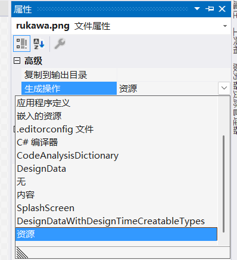

[TOC]

# WPF 学习笔记

## WPF概述

Windows APIWindows Presentation Foundation (WPF) 是下一代显示系统，用于生成能带给用户震撼视觉体验的 Windows 客户端应用程序。WPF 的核心是一个与分辨率无关并且基于矢量的呈现引擎。WPF 提供了一整套应用程序开发功能，包括可扩展应用程序标记语言 (XAML) 、控件 、数据绑定 、布局 、二维和三维图形 、动画 、样式 、模板 、文档 、媒体 、文本和版式。

WPF 作为 .NET 类型的一个子集存在，大部分位于 System.Windows 命名空间中。 如果你曾经使用 ASP.NET 和 Windows 窗体等框架通过 .NET 构建应用程序，应该会熟悉基本的 WPF 编程体验：

- 实例化类
- 设置属性
- 调用方法
- 处理事件

WPF 还包括可增强属性和事件的其他编程构造：依赖项属性和路由事件。

通过 WPF，可以使用标记和隐藏代码开发应用程序，这是 ASP.NET 开发人员已经熟悉的体验。 通常使用 XAML 标记实现应用程序的外观，同时使用托管编程语言（隐藏代码）来实现其行为。 这种外观和行为的分离具有以下优点：

- 降低了开发和维护成本，因为特定于外观的标记与特定于行为的代码不紧密耦合。

- 开发效率更高，因为设计人员在实现应用程序外观的同时，开发人员可以实现应用程序的行为。

- WPF 应用程序的全球化和本地化得以简化。

### XMAL

XAML 是一种基于 XML 的标记（markup）语言，以声明形式实现应用程序的外观。 通常用它定义窗口 、对话框 、页面和用户控件，并填充控件 、形状和图形。

### 隐藏代码

在 WPF 中，在与XAML相关联的代码中实现此行为。 此类代码称为隐藏代码(code-behind)。 

XAML:

```XML
<Window x:Class="WPFLearning.MainWindow"
        xmlns="http://schemas.microsoft.com/winfx/2006/xaml/presentation"
        xmlns:x="http://schemas.microsoft.com/winfx/2006/xaml"
        xmlns:d="http://schemas.microsoft.com/expression/blend/2008"
        xmlns:mc="http://schemas.openxmlformats.org/markup-compatibility/2006"
        xmlns:local="clr-namespace:WPFLearning"
        mc:Ignorable="d"
        Title="WPF学习" Height="245" Width="480" WindowStartupLocation="CenterScreen">
        
        <Button x:Name="btn_helloWPF" Margin="0,5,0,0" Click="Btn_HelloWPF_Click">Click Me</Button>
</Window>
```


隐藏代码:
```CSharp
namespace WPFLearning
{
    /// <summary>
    /// Interaction logic for MainWindow.xaml
    /// </summary>
    public partial class MainWindow : Window
    {
        public MainWindow()
        {
            InitializeComponent();
        }

        private void Btn_HelloWPF_Click(object sender, RoutedEventArgs e)
        {
            MessageBox.Show("Hello WPF!");
        }
    }
}

```

- `x:Class` 用于标记与哪个隐藏代码类（code-behind class）相关联
- 隐藏代码类的构造函数中调用的函数`InitializeComponent()`将`XAML`定义的UI与隐藏代码类整合起来。它是自动生成的，无需手动实现。

### 输入和命令

### WPF控件

- 按钮： `Button` 和 `RepeatButton。`
- 数据显示：`DataGrid` 、`ListView` 和 `TreeView`。
- 日期显示和选项： `Calendar` 和 `DatePicker`。
- 对话框： `OpenFileDialog` 、 `PrintDialog`和 `SaveFileDialog`。
- 数字墨迹： `InkCanvas` 和 `InkPresenter`。
- 文档： `DocumentViewer` 、 `FlowDocumentPageViewer` 、 `FlowDocumentReader` 、 `FlowDocumentScrollViewer`和 `StickyNoteControl`。
- 输入： `TextBox` 、 `RichTextBox`和 `PasswordBox`。
- 布局： `Border` 、 `BulletDecorator` 、 `Canvas` 、 `DockPanel` 、 `Expander` 、 `Grid` 、 `GridView` 、 `GridSplitter` 、 `GroupBox` 、 `Panel` 、 `ResizeGrip` 、 `Separator` 、 `ScrollBar` 、 `ScrollViewer` 、 `StackPanel` 、 `Thumb` 、 `Viewbox` 、 `VirtualizingStackPanel` 、 `Window和` `WrapPanel`。
- 媒体： `Image` 、 `MediaElement` 和 `SoundPlayerAction`。
- 菜单： `ContextMenu` 、 `Menu` 和 `ToolBar`。
- 导航： `Frame` 、 `Hyperlink` 、 `Page` 、 `NavigationWindow` 和 `TabControl` 。
- 选项： `CheckBox` 、 `ComboBox` 、 `ListBox` 、 `RadioButton` 和 `Slider`。
- 用户信息： `AccessText` 、 `Label` 、 `Popup` 、 `ProgressBar` 、 `StatusBar` 、 `TextBlock` 和 `ToolTip`。

### Layout

创建用户界面时，按照位置和大小排列控件以形成布局。 任何布局的一项关键要求都是适应窗口大小和显示设置的变化。 WPF 为你提供一流的可扩展布局系统，而不强制你编写代码以适应这些情况下的布局。

布局系统的基础是相对定位，这提高了适应不断变化的窗口和显示条件的能力。 该布局系统还可管理控件之间的协商以确定布局。 协商是一个两步过程：首先，控件将需要的位置和大小告知父级。 其次，父级将控件可以有的空间告知控件。

该布局系统通过基 WPF 类公开给子控件。 对于通用的布局（如网格 、堆叠和停靠），WPF 包括若干布局控件：

Canvas：子控件提供其自己的布局。

DockPanel：子控件与面板的边缘对齐。

Grid：子控件由行和列定位。

StackPanel：子控件垂直或水平堆叠。

VirtualizingStackPanel：子控件在水平或垂直的行上虚拟化并排列。

WrapPanel：子控件按从左到右的顺序放置，在当前行上的空间不足时 换行到下一行。

### 数据绑定

大多数应用程序旨在为用户提供查看和编辑数据的方法。 对于 WPF 应用程序，存储和访问数据的工作已由许多不同的 .NET 数据访问库（例如 SQL 和 Entity Framework Core）提供。 访问数据并将数据加载到应用程序的托管对象后，WPF 应用程序的复杂工作开始。 从根本上来说，这涉及到两件事：

- 将数据从托管对象复制到控件，在控件中可以显示和编辑数据。

- 确保使用控件对数据所做的更改将复制回托管对象。

为了简化应用程序开发，WPF 提供了一个强大的数据绑定引擎来自动处理这些步骤。 数据绑定引擎的核心单元是 Binding 类，其工作是将控件（绑定目标）绑定到数据对象（绑定源）。 


WPF 支持直接在 XAML 标记中声明绑定。 例如，下面的 XAML 代码使用`{Binding ... }` XAML 语法将 TextBox 的 Text 属性绑定到对象的 Name 属性。 

```XML
 <Window
     xmlns="http://schemas.microsoft.com/winfx/2006/xaml/presentation"
     xmlns:x="http://schemas.microsoft.com/winfx/2006/xaml"
     x:Class="SDKSample.DataBindingWindow">

   <!-- Bind the TextBox to the data source (TextBox.Text to Person.Name) -->
   <TextBox Name="personNameTextBox" Text="{Binding Path=Name}" />

 </Window>
```

### 内容模型

大多数 WPF 控件的主要用途是显示内容。 在 WPF 中，可以构成控件内容的项的类型和数目称为控件的 内容模型。 某些控件可以包含一种内容类型的一个项。 例如，TextBox 的内容是分配给 Text 属性的一个字符串值。

但是，其他控件可以包含不同内容类型的多个项；Button 的内容（由 Content 属性指定）可以包含各种项，包括布局控件 、文本 、图像和形状。

### 触发器

尽管 XAML 标记的主要用途是实现应用程序的外观，你也可以使用 XAML 来实现应用程序行为的某些方面。 其中一个示例是使用触发器来基于用户交互更改应用程序的外观。

### 模板

WPF 控件的默认用户界面通常是从其他控件和形状构造的。 例如， Button 由 ButtonChrome 和 ContentPresenter 控件组成。 ButtonChrome 提供了标准按钮外观，而 ContentPresenter 显示按钮的内容，正如 Content 属性所指定。

有时，某个控件的默认外观可能与应用程序的整体外观冲突。 在这种情况下，可以使用 ControlTemplate 更改控件的用户界面的外观，而不更改其内容和行为。

### 数据模板

使用控件模板可以指定控件的外观，而使用数据模板则可以指定控件内容的外观。 数据模板经常用于改进绑定数据的显示方式。


上图显示 ListBox 的默认外观，它绑定到 Task 对象的集合，默认时是ListBox的外观。 但是，每个任务的默认外观仅包含任务名称。 若要显示任务名称 、描述和优先级，必须使用 ListBox 更改 DataTemplate控件绑定列表项的默认外观。 下面是一个示例，说明如何应用为 Task 对象创建的数据模板。


ListBox 会保留其行为和整体外观；只有列表框所显示内容的外观发生变化。

### 样式

通过样式功能，开发人员和设计人员能够对其产品的特定外观进行标准化。 WPF 提供了一个强样式模型，其基础是 Style 元素。 样式可以将属性值应用于类型。 引用样式时，可以根据类型将其自动应用于所有对象，或应用于单个对象。 

### 资源

应用程序中的控件应共享相同的外观，它可以包括从字体和背景色到控件模板 、数据模板和样式的所有内容。 你可以对用户界面资源使用 WPF 支持，以将这些资源封装在一个位置以便重复使用。

下面的示例定义 Button 和 Label共享的通用背景色：

```XML
<Window
    xmlns="http://schemas.microsoft.com/winfx/2006/xaml/presentation"
    xmlns:x="http://schemas.microsoft.com/winfx/2006/xaml"
    x:Class="SDKSample.ResourcesWindow"
    Title="Resources Window">

  <!-- Define window-scoped background color resource -->
  <Window.Resources>
    <SolidColorBrush x:Key="defaultBackground" Color="Red" />
  </Window.Resources>

  <!-- Button background is defined by window-scoped resource -->
  <Button Background="{StaticResource defaultBackground}">One Button</Button>

  <!-- Label background is defined by window-scoped resource -->
  <Label Background="{StaticResource defaultBackground}">One Label</Label>
</Window>
```

## 控件

### 布局控件

#### Grid

XAML 中提供的默认布局控件是 `<Grid>` 控件。

通过使用 Grid 控件，可以像定义表一样定义行和列，并将控件置于特定行和列组合的边界内。 你可以将任意数量的子控件或其他布局控件添加到 Grid 中。 例如，你可以在特定的行和列组合中放置另一个 Grid 控件，然后新的 Grid 可以定义更多的行和列，并拥有自己的子级。

`<Grid>` 控件定义控件所在的行和列。 网格始终只声明单行和单列，这意味着默认情况下，网格就是一个单元格。 这并不能让你真正灵活地放置控件。

在添加新的行和列之前，请向 `<Grid>` 元素添加一个新特性：Margin="10"。 这样就可以从窗口中插入网格，使它看起来更漂亮一些。

接下来，定义两行两列，将网格划分为四个单元格：

```XML
<Window x:Class="Names.LayoutStep2"
        xmlns="http://schemas.microsoft.com/winfx/2006/xaml/presentation"
        xmlns:x="http://schemas.microsoft.com/winfx/2006/xaml"
        xmlns:d="http://schemas.microsoft.com/expression/blend/2008"
        xmlns:mc="http://schemas.openxmlformats.org/markup-compatibility/2006"
        xmlns:local="clr-namespace:Names"
        mc:Ignorable="d"
        Title="Names" Height="180" Width="260">
    <Grid Margin="10">
        
        <Grid.RowDefinitions>
            <RowDefinition Height="*" />
            <RowDefinition Height="*" />
        </Grid.RowDefinitions>

        <Grid.ColumnDefinitions>
            <ColumnDefinition Width="*" />
            <ColumnDefinition Width="*" />
        </Grid.ColumnDefinitions>
        
    </Grid>
</Window>

```
<Label>Names</Label> 定义内容 Names。 有些控件知道如何处理内容，有些则不知道。 控件的内容映射到 Content 属性。 通过 XAML 特性语法设置内容时，将使用以下格式：<Label Content="Names" />。 这两种方法可以实现相同的目的，即，将标签内容设置为显示文本 Names。

不过，我们有一个问题，由于标签是自动分配给网格的第一行和第一列的，因此它占据了半个窗口。 对于第一行，我们不需要那么多空间，因为我们只需要在这一行放置标签。 将第一个 <RowDefinition> 的 Height 特性从 * 更改为 Auto。 Auto 值会自动将网格行的大小调整为其内容（在本例中为标签控件）的大小。

### 控件属性

#### WinddowStartUpLocation

窗口打开后所在位置

## 窗口

窗口生存周期：


## 数据绑定

### 什么是数据绑定

数据绑定是在应用 UI 与其显示的数据之间建立连接的过程。 如果绑定具有正确的设置，并且数据提供适当的通知，则在数据更改其值时，绑定到该数据的元素会自动反映更改。 数据绑定还意味着，如果元素中数据的外部表示形式发生更改，则基础数据可以自动进行更新以反映更改。 例如，如果用户编辑 TextBox 元素中的值，则基础数据值会自动更新以反映该更改。

数据绑定的典型用法是将服务器或本地配置数据放置到窗体或其他 UI 控件中。 此概念在 WPF 中得到扩展，包括将大量属性绑定到不同类型的数据源。 在 WPF 中，元素的依赖属性可以绑定到 .NET 对象（包括 ADO.NET 对象或与 Web 服务和 Web 属性关联的对象）和 XML 数据。

### 基本概念

数据绑定 模型


如图所示，数据绑定实质上是绑定目标与绑定源之间的桥梁。 该图演示了以下基本的 WPF 数据绑定概念：

- 通常情况下，每个绑定具有四个组件：
  - 绑定目标对象。
  - 目标属性。
  - 绑定源。
  - 指向绑定源中要使用的值的路径。
- 目标属性必须为依赖属性。
  大多数 UIElement 属性都是依赖属性，而大多数依赖属性（只读属性除外）默认支持数据绑定。 只有从 DependencyObject 派生的类型才能定义依赖项属性。 所有 UIElement 类型从 DependencyObject 派生。
- 绑定源不限于自定义 .NET 对象。
  尽管未在图中显示，但请注意，绑定源对象不限于自定义 .NET 对象。 WPF 数据绑定支持 .NET 对象 、XML 甚至是 XAML 元素对象形式的数据。 例如，绑定源可以是 UIElement 、任何列表对象 、ADO.NET 或 Web 服务对象，或包含 XML 数据的 XmlNode。 
  
#### 数据上下文

当在 XAML 元素上声明数据绑定时，它们会通过查看其直接的 DataContext 属性来解析数据绑定。 数据上下文通常是绑定源值路径评估的绑定源对象。 可以在绑定中重写此行为，并设置特定的绑定源对象值。 如果未设置承载绑定的对象的 DataContext 属性，则将检查父元素的 DataContext 属性，依此类推，直到 XAML 对象树的根。 简而言之，除非在对象上显式设置，否则用于解析绑定的数据上下文将继承自父级。

绑定可以配置为使用特定的对象进行解析，而不是使用数据上下文进行绑定解析。 例如，在将对象的前景色绑定到另一个对象的背景色时，将使用直接指定源对象。 无需数据上下文，因为绑定在这两个对象之间解析。 相反，未绑定到特定源对象的绑定使用数据上下文解析。

当 DataContext 属性发生更改时，重新评估可能会受数据上下文影响的所有绑定。

#### 数据流的方向

正如上图中的箭头所示，绑定的数据流可以从绑定目标流向绑定源（例如，当用户编辑 TextBox 的值时，源值会发生更改）和/或（在绑定源提供正确通知的情况下）从绑定源流向绑定目标（例如，TextBox 内容会随绑定源中的更改而进行更新）。

你可能希望应用允许用户更改数据，然后将该数据传播回源对象。 或者，可能不希望允许用户更新源数据。 可以通过设置 Binding.Mode 来控制数据流。

此图演示了不同类型的数据流：


- 通过 OneWay 绑定，对源属性的更改会自动更新目标属性，但对目标属性的更改不会传播回源属性。 如果绑定的控件为**隐式只读**，则此类型的绑定适用。 
  例如，可能会绑定到股票行情自动收录器这样的源，也可能目标属性没有用于进行更改的控件接口（例如表的数据绑定背景色）。 如果无需监视目标属性的更改，则使用 OneWay 绑定模式可避免 TwoWay 绑定模式的系统开销。
- 通过 TwoWay 绑定，更改源属性或目标属性时会自动更新另一方。 此类型的绑定适用于可编辑窗体或其他完全交互式 UI 方案。 
  大多数属性默认为 OneWay 绑定，但某些依赖属性（通常为用户可编辑控件的属性，例如 `TextBox.Text` 和 `CheckBox.IsChecked`）默认为 TwoWay 绑定。 用于确定依赖属性绑定在默认情况下是单向还是双向的编程方法是：使用 `DependencyProperty.GetMetadata` 获取属性元数据，然后检查 `FrameworkPropertyMetadata.BindsTwoWayByDefault` 属性的布尔值。
- OneWayToSource 绑定与 OneWay 绑定相反；当目标属性更改时，它会更新源属性。 一个示例方案是只需要从 UI 重新计算源值的情况。
- OneTime 绑定未在图中显示，该绑定会使源属性初始化目标属性，但不传播后续更改。 如果数据上下文发生更改，或者数据上下文中的对象发生更改，则更改不会在目标属性中反映。 
  如果适合使用当前状态的快照或数据实际为**静态数据**，则此类型的绑定适合。 如果你想使用源属性中的某个值来**初始化目标属性**，且提前不知道数据上下文，则此类型的绑定也有用。 此模式实质上是 OneWay 绑定的一种简化形式，它在源值不更改的情况下提供更好的性能。

#### 触发源更新的因素

TwoWay 或 OneWayToSource 绑定侦听目标属性中的更改，并将更改传播回源（称为更新源）。 例如，可以编辑文本框的文本以更改基础源值。

但是，在编辑文本时或完成文本编辑后控件失去焦点时，源值是否会更新？ 

`Binding.UpdateSourceTrigger` 属性确定触发源更新的因素。 下图中右箭头的点说明了 `Binding.UpdateSourceTrigger` 属性的角色。


如果 `UpdateSourceTrigger` 值为 `UpdateSourceTrigger.PropertyChanged`，则目标属性更改后，TwoWay 或 OneWayToSource 绑定的右箭头指向的值会立即更新。 但是，如果 `UpdateSourceTrigger` 值为 `LostFocus`，则仅当目标属性失去焦点时才会使用新值更新该值。

## 第一个WPF应用

### 创建应用程序项目

创建名为 ExpenseIt 的新 WPF 应用程序项目，此应用根据用户输入导航到不同的内容。

首先将 ` MainWindow.xaml` 中的 `Window` 元素改为 `NavigationWindow`，移除 `Grid` 元素。

```XML
<NavigationWindow x:Class="ExpenseIt.MainWindow"
        xmlns="http://schemas.microsoft.com/winfx/2006/xaml/presentation"
        xmlns:x="http://schemas.microsoft.com/winfx/2006/xaml"
        xmlns:d="http://schemas.microsoft.com/expression/blend/2008"
        xmlns:mc="http://schemas.openxmlformats.org/markup-compatibility/2006"
        xmlns:local="clr-namespace:ExpenseIt"
        mc:Ignorable="d"
        Title="ExpenseIt" Height="450" Width="800">
</NavigationWindow>
```

相应的，`MainWindow.xaml.cs` 中继承自 `Window` 类改为 `NavigationWindow`。

```C
    public partial class MainWindow : NavigationWindow
    {
        ...
    }
```

### 添加页面

本部分将向应用程序添加两个页面和一个图像。

添加 `ExpenseItHome` 页面。此为应用程序启动显示的第一个页面。

```XML
<Page x:Class="ExpenseIt.ExpenseItHome"
      xmlns="http://schemas.microsoft.com/winfx/2006/xaml/presentation"
      xmlns:x="http://schemas.microsoft.com/winfx/2006/xaml"
      xmlns:mc="http://schemas.openxmlformats.org/markup-compatibility/2006" 
      xmlns:d="http://schemas.microsoft.com/expression/blend/2008" 
      xmlns:local="clr-namespace:ExpenseIt"
      mc:Ignorable="d" 
      d:DesignHeight="450" d:DesignWidth="800"
      Title="ExpenseIt - Home">

    <Grid>
        
    </Grid>
</Page>
```

在 `MainWindow.xaml` 中 将 `Source` 属性添加到 `NavigationWindow` 元素并将它设置为 `ExpenseItHome.xaml`。这样 `ExpenseItHome.xaml` 为打开应用程序显示的第一个页面。

```XML
<NavigationWindow x:Class="ExpenseIt.MainWindow"
        ...
        Title="ExpenseIt" Height="450" Width="800" Source="ExpenseItHome.xaml">

</NavigationWindow>
```

添加另一个新页面 `ExpenseReportPage.xaml`，此页将显示在 `ExpenseItHome` 页上选择的人员的费用报表。

```XML
<Page x:Class="ExpenseIt.ExpenseReportPage"
      ...
      Title="ExpenseIt - View Expense">

    <Grid>
        
    </Grid>
</Page>
```

添加图像到项目，选中图像，在属性窗口中，将生成操作设置为资源。




### 创建布局

#### 布局控件

- `Canvas` 
  - 定义一个区域，可在其中使用相对于画布区域的坐标以显式方式来定位子元素。
- DockPanel 
  - 定义一个区域，从中可以按相对位置水平或垂直排列各个子元素。
- `Grid`
  - 定义由列和行组成的灵活的网格区域。
- `StackPanel`
  - 将子元素排列成水平或垂直的一行。
- `VirtualizingStackPanel` 
  - 在水平或垂直的一行中排列并显示内容。
- `WrapPanel` 
  - 按从左到右的顺序位置定位子元素，在包含框的边缘处将内容切换到下一行。 后续排序按照从上至下或从右至左的顺序进行，具体取决于方向属性的值。

本示例中使用 `Grid` 做为布局元素。

在 `ExpenseItHome.xaml` 中，定义一个三行一列的布局：

```XML
<Page x:Class="ExpenseIt.ExpenseItHome"
      ...>

    <Grid Margin="5">
        <Grid.ColumnDefinitions>
            <ColumnDefinition/>
        </Grid.ColumnDefinitions>
        <Grid.RowDefinitions>
            <RowDefinition Height="auto"/>
            <RowDefinition/>
            <RowDefinition Height="auto"/>
        </Grid.RowDefinitions>
    </Grid>
</Page>

```

其中属性 `Margin` 将边距设为了5，`Height="auto"` 表示高度随内容进行调整，如果不进行赋值，默认为 `Height="*"`，这样高度会尽可能地占据可用空间，如果多行均为 `*` 则平分空间，利用  `*` 还可以成比例地分配空间，如：

```XML
<Grid>
    <Grid.RowDefinitions>
        <RowDefinition Height="*"/>
        <RowDefinition Height="2*"/>
        <RowDefinition Height="3*"/>
    </Grid.RowDefinitions>
</Grid>
```

三行的比例为 1:2:3。

### 添加控件

添加人员列表，我们的目标是可以选择其中一个人员，显示其费用报表。

```XML
<Page x:Class="ExpenseIt.ExpenseItHome"
      ...>

    <Grid Margin="5">
        <Grid.ColumnDefinitions>
            <ColumnDefinition/>
        </Grid.ColumnDefinitions>
        <Grid.RowDefinitions>
            <RowDefinition Height="auto"/>
            <RowDefinition/>
            <RowDefinition Height="auto"/>
        </Grid.RowDefinitions>

        <!-- People list -->
        <Border Grid.Column="0" Grid.Row="0" Height="35" Padding="5" Background="#4E87D4">
            <Label VerticalAlignment="Center" Foreground="White">Names</Label>
        </Border>
        <ListBox Name="peopleListBox" Grid.Column="0" Grid.Row="1">
            <ListBoxItem>Mike</ListBoxItem>
            <ListBoxItem>Lisa</ListBoxItem>
            <ListBoxItem>John</ListBoxItem>
            <ListBoxItem>Mary</ListBoxItem>
        </ListBox>

        <!-- View report button -->
        <Button Grid.Column="0" Grid.Row="2" 
                Margin="0,10,0,0" Width="125" 
                Height="25" HorizontalAlignment="Right">
            View
        </Button>
    </Grid>
</Page>

```


### 添加图像和标题

添加行列，加入背景图像和标题，把之前添加的控件位置做相应的调整。

```XML
<Page x:Class="ExpenseIt.ExpenseItHome"
      ...>

    <Grid Margin="5">
        ...

        <Grid.Background>
            <ImageBrush ImageSource="rukawa.png"/>
        </Grid.Background>
        <Label Grid.Column="1" VerticalAlignment="Center" FontFamily="Trebuchet MS" 
               FontWeight="Bold" FontSize="28" Foreground="#0066cc">
            View Expense Report
        </Label>
        <!-- People list -->
        <Border Grid.Column="1" Grid.Row="1" Height="35" Padding="5" Background="#4E87D4">
            <Label VerticalAlignment="Center" Foreground="White">Names</Label>
        </Border>
        <ListBox Name="peopleListBox" Grid.Column="2" Grid.Row="2">
            ...
        </ListBox>

        <!-- View report button -->
        <Button Grid.Column="1" Grid.Row="3" 
                Margin="0,10,0,0" Width="125" 
                Height="25" HorizontalAlignment="Right">
            View
        </Button>
    </Grid>
</Page>

```


### 给按钮添加处理事件的代码

在 `ExpenseItHome.xaml` 中，将 `Click` 事件处理程序添加到 `Button` 元素。

```XML
<Button ... Click="BtnClick_ViewExpense"> View </Button>
```

右键转到事件处理函数定义处。


添加代码：

```C
private void BtnClick_ViewExpense(object sender, RoutedEventArgs e)
{
    ExpenseReportPage expenseReportPage = new ExpenseReportPage();
    NavigationService.Navigate(expenseReportPage);
}
```

### 为报表页面创建UI

`ExpenseReportPage.xaml` 显示在 `ExpenseItHome` 页中选择的人员的费用报表。 本部分将为 `ExpenseReportPage` 创建 UI，还会向各种 UI 元素添加背景色和填充色。

```XML
<Page ...>

    <Grid>
        <Grid.Background>
            <ImageBrush ImageSource="rukawa.png"/>
        </Grid.Background>
        <Grid.ColumnDefinitions>
            <ColumnDefinition Width="230"/>
            <ColumnDefinition/>
        </Grid.ColumnDefinitions>
        <Grid.RowDefinitions>
            <RowDefinition Height="Auto" />
            <RowDefinition />
        </Grid.RowDefinitions>

        <Label Grid.Column="1" VerticalAlignment="Center" FontFamily="Trebuchet MS" 
 FontWeight="Bold" FontSize="18" Foreground="#0066cc">
            Expense Report For:
        </Label>

        <Grid Margin="10" Grid.Column="1" Grid.Row="1">

            <Grid.ColumnDefinitions>
                <ColumnDefinition />
                <ColumnDefinition />
            </Grid.ColumnDefinitions>
            <Grid.RowDefinitions>
                <RowDefinition Height="Auto" />
                <RowDefinition Height="Auto" />
                <RowDefinition />
            </Grid.RowDefinitions>

            <!-- Name -->
            <StackPanel Grid.Column="0" Grid.ColumnSpan="2" Grid.Row="0" Orientation="Horizontal">
                <Label Margin="0,0,0,5" FontWeight="Bold">Name:</Label>
                <Label Margin="0,0,0,5" FontWeight="Bold"></Label>
            </StackPanel>

            <!-- Department -->
            <StackPanel Grid.Column="0" Grid.ColumnSpan="2" Grid.Row="1" Orientation="Horizontal">
                <Label Margin="0,0,0,5" FontWeight="Bold">Department:</Label>
                <Label Margin="0,0,0,5" FontWeight="Bold"></Label>
            </StackPanel>

            <Grid Grid.Column="0" Grid.ColumnSpan="2" Grid.Row="2" 
                  VerticalAlignment="Top" HorizontalAlignment="Left">
                <!-- Expense type and Amount table -->
                <DataGrid  AutoGenerateColumns="False" RowHeaderWidth="0" >
                    <DataGrid.ColumnHeaderStyle>
                        <Style TargetType="{x:Type DataGridColumnHeader}">
                            <Setter Property="Height" Value="35" />
                            <Setter Property="Padding" Value="5" />
                            <Setter Property="Background" Value="#4E87D4" />
                            <Setter Property="Foreground" Value="White" />
                        </Style>
                    </DataGrid.ColumnHeaderStyle>
                    <DataGrid.Columns>
                        <DataGridTextColumn Header="ExpenseType" />
                        <DataGridTextColumn Header="Amount"  />
                    </DataGrid.Columns>
                </DataGrid>
            </Grid>
        </Grid>
    </Grid>
</Page>

```

效果：


### 样式控件

通过定义样式可以使多个同样元素具有相同外观。 重复使用样式有助于简化 XAML 的创建和管理。本部分将定义样式来替换在前面步骤中的元素样式。

在 `App.xaml` 中的 `Application.Resources` 标记之间添加以下 XAML：

```XML
<!-- Header text style -->
<Style x:Key="headerTextStyle">
    <Setter Property="Label.VerticalAlignment" Value="Center"></Setter>
    <Setter Property="Label.FontFamily" Value="Trebuchet MS"></Setter>
    <Setter Property="Label.FontWeight" Value="Bold"></Setter>
    <Setter Property="Label.FontSize" Value="18"></Setter>
    <Setter Property="Label.Foreground" Value="#0066cc"></Setter>
</Style>

<!-- Label style -->
<Style x:Key="labelStyle" TargetType="{x:Type Label}">
    <Setter Property="VerticalAlignment" Value="Top" />
    <Setter Property="HorizontalAlignment" Value="Left" />
    <Setter Property="FontWeight" Value="Bold" />
    <Setter Property="Margin" Value="0,0,0,5" />
</Style>

<!-- DataGrid header style -->
<Style x:Key="columnHeaderStyle" TargetType="{x:Type DataGridColumnHeader}">
    <Setter Property="Height" Value="35" />
    <Setter Property="Padding" Value="5" />
    <Setter Property="Background" Value="#4E87D4" />
    <Setter Property="Foreground" Value="White" />
</Style>

<!-- List header style -->
<Style x:Key="listHeaderStyle" TargetType="{x:Type Border}">
    <Setter Property="Height" Value="35" />
    <Setter Property="Padding" Value="5" />
    <Setter Property="Background" Value="#4E87D4" />
</Style>

<!-- List header text style -->
<Style x:Key="listHeaderTextStyle" TargetType="{x:Type Label}">
    <Setter Property="Foreground" Value="White" />
    <Setter Property="VerticalAlignment" Value="Center" />
    <Setter Property="HorizontalAlignment" Value="Left" />
</Style>

<!-- Button style -->
<Style x:Key="buttonStyle" TargetType="{x:Type Button}">
    <Setter Property="Width" Value="125" />
    <Setter Property="Height" Value="25" />
    <Setter Property="Margin" Value="0,10,0,0" />
    <Setter Property="HorizontalAlignment" Value="Right" />
</Style>
```

这段XAML添加了以下样式：

- `headerTextStyle`：可设置页标题 `Label` 的格式。
- `labelStyle`：可设置 `Label` 控件的格式。
- `columnHeaderStyle`：可设置 `DataGridColumnHeader` 的格式。
- `listHeaderStyle`：可设置列表标头 `Border` 控件的格式。
- `listHeaderTextStyle`：可设置列表标题 `Label` 的格式。
- `buttonStyle`：可设置 `Button` 的格式。

在元素中通过设置 `Style` 属性来指定样式：

在 `ExpenseItHome.xaml` 中：

```XML
    ...

   <!-- People list -->  
   <Label Grid.Column="1" Style="{StaticResource headerTextStyle}" >
       View Expense Report
   </Label>
   
   <Border Grid.Column="1" Grid.Row="1" Style="{StaticResource listHeaderStyle}">
       <Label Style="{StaticResource listHeaderTextStyle}">Names</Label>
   </Border>
   <ListBox Name="peopleListBox" Grid.Column="1" Grid.Row="2">
       <ListBoxItem>Mike</ListBoxItem>
       <ListBoxItem>Lisa</ListBoxItem>
       <ListBoxItem>John</ListBoxItem>
       <ListBoxItem>Mary</ListBoxItem>
   </ListBox>

   <!-- View report button -->
   <Button Grid.Column="1" Grid.Row="3" Click="Button_Click" Style="{StaticResource buttonStyle}">View</Button>
```

## 实用技巧

### 控制启动运行

有的时候，我们希望同一台机器只能运行一个应用程序，或者是程序启动之前做一些操作，我们就需要通过一些手段来WPF程序的启动运行。

#### 方式1，重写`OnstartUp()`方法

```XML
<Application ...
             StartupUri="MainWindow.xaml">
    <Application.Resources>
         ...
    </Application.Resources>
</Application>
```

在`App.xaml`中，`StartupUri="MainWindow.xaml"`指向了启动的窗口，我们删除这个属性，改用程序代码控制窗口的启动。

在`App.xaml.cs`中重写`OnStartUp()`方法，在其中实现一些想要的操作。

```CSharp
/// <summary>
/// Interaction logic for App.xaml
/// </summary>
public partial class App : Application
{
    protected override void OnStartup(StartupEventArgs e)
    {
        base.OnStartup(e);//必须最先执行
                    
        MainWindow window = new MainWindow();
        
        //一些业务处理或初始化操作
        
        window.Show();
    }
}
```

#### 方式2，`Program`的`Main()`中实现窗口启动运行

WPF中没有显示地提供一个程序入口，我们可以新建一个`Program.cs`，并定义`Main()`方法，来手动实现程序入口。

```CSharp
class Program
{
    [STAThread]
    static void Main(string[] args)
    {
        App app = new App();
        app.Run(new MainWindow());
    }
}
```

直接编译程序会出现报错：

> Program.cs(12,21,12,25): error CS0017: 程序定义了多个入口点。使用 /main (指定包含入口点的类型)进行编译。

在项目设置中选择启动对象：


### UI线程Dispatch对象

WPF的UI控件都继承自`DispatcherObject`，具有`Dispatcher`属性，只有创建`Dispatcher`的线程才能直接访问`DispatcherObject`对象，也就是说，WPF不允许在UI线程之外直接对UI控件的属性进行修改。


如上图所示，新建了一个线程，在其中直接修改文本控件的属性值，引发了`InvalidOperarionException`异常。

正确的做法是调用`Dispatcher`对象去`Invoke`一个`Action`。

```CSharp
private void ButtonModifyName_Click(object sender, RoutedEventArgs e)
{
    Thread thread = new Thread(delegate ()
    {
        txtName.Dispatcher.Invoke(new Action(delegate ()
        {
            txtName.Text = "111";
        }));
    });
    thread.Start();
}
```

另，上述代码可简写为

```CSharp
private void ButtonModifyName_Click(object sender, RoutedEventArgs e)
{
    Thread thread = new Thread(() => txtName.Dispatcher.Invoke(new Action(() => txtName.Text = "111")));
}
```


## MVVM 

MVVM 是Model-View-ViewModel的简写。它本质上就是MVC 的改进版。MVVM 就是将其中的View 的状态和行为抽象化，让我们将视图 UI 和业务逻辑分开。当然这些事 ViewModel 已经帮我们做了，它可以取出 Model 的数据同时帮忙处理 View 中由于需要展示内容而涉及的业务逻辑。

包 `CommunityToolkit.Mvvm` (名为 MVVM 工具包，以前名为 Microsoft.Toolkit.Mvvm) 是一个现代、快速和模块化的 MVVM 库。 它是 Windows 社区工具包的一部分，围绕以下原则构建：

- 平台和运行时独立 - .NET Standard 2.0、 .NET Standard 2.1 和 .NET 6🚀 (UI Framework 无关)
- 易于选取和使用 - 无需对应用程序结构或编码范例的严格要求， (“MVVM”) 之外，即灵活使用。
- 笛卡尔 - 自由选择要使用的组件。
- 参考实现 - 精益和高性能，为基类库中包含的接口提供实现，但缺少直接使用它们的具体类型。

MVVM 工具包由 Microsoft 维护和发布，也是 .NET Foundation 的一部分。 它还由内置于 Windows 的多个第一方应用程序（如 Microsoft Store）使用。

### MVVM 工具

- 命令： 我们需要视图才能请求 `viewmodel` 从所选子目录重新加载当前帖子列表。 我们可以使用 `AsyncRelayCommand` 该类型包装一个私有方法，该方法将从 `Reddit` 提取帖子。 在这里，我们将通过 `IAsyncRelayCommand` 接口公开命令，以避免对所使用的确切命令类型的强引用。 这也使我们能够将来可能更改命令类型，而无需担心依赖所使用的特定类型的任何 UI 组件。
- 属性： 我们需要向 UI 公开许多值，如果它们是我们想要完全替换的值，或者使用自己可观测的属性 (例如，可以使用这些值。 `ObservableCollection<T>`) 。 在本例中，我们有：
  - `ObservableCollection<object> Posts`，它是已加载帖子的可观测列表。 此处我们只是用作 object 占位符，因为我们尚未创建用于表示帖子的模型。 我们稍后可以替换此代码。
  - `IReadOnlyList<string> Subreddits`，它是一个只读列表，其中包含我们允许用户从中选择的子名称。 此属性永远不会更新，因此它不需要可观测。
  - `string SelectedSubreddit`，即当前选定的子 `reddit`。 此属性需要绑定到 UI，因为它将用于指示加载示例时的最后一个所选子数据，并在用户更改所选内容时直接从 UI 操作。 下面我们将使用 `SetProperty` 类中的 `ObservableObject` 方法。
  - `object SelectedPost`，这是当前选定的帖子。 在本例中，我们将使用 `SetProperty` 类中的 `ObservableRecipient` 方法来指示当此属性更改时，我们还希望广播通知。 这样做是为了通知帖子小组件当前帖子选择已更改。
- 方法： 我们只需要一个私有 `LoadPostsAsync` 方法，该方法将由异步命令包装，并包含从所选子数据加载帖子的逻辑。

### 示例

通过一个示例来学习 `CommunityToolkit.Mvvm` 的使用，在这个示例中我们想要构建的内容如下：

- 由两个“小组件”组成的最小 Reddit 浏览器：
  - 一个显示子订阅的帖子，
  - 另一个显示当前所选帖子。 
  - 这两个小组件需要是自包含的，并且没有对彼此的强引用。
- 我们希望用户能够从可用选项列表中选择一个 subreddit，
  - 并且可以将所选的 subreddit 保存到设置，在下次加载示例时将其加载。
  - subreddit 小组件还应有刷新按钮来重新加载当前 subreddit。
- 出于此示例的目的，我们将只向所有加载的帖子分配一个示例文本，并直接显示该文本，以简化操作。

#### 设置 viewmodel

Subreddit 组件的 ViewModel：

```CSharp
using System.Collections.Generic;
using System.Threading.Tasks;
using System.Collections.ObjectModel;

using CommunityToolkit.Mvvm.ComponentModel;
using CommunityToolkit.Mvvm.Input;

namespace WPFLearning.ViewModel
{
    /// <summary>
    /// Subreddit 组件的Viewmodel
    /// </summary>
    public sealed partial class SubredditWidgetViewModel : ObservableRecipient
    {
        /// <summary>
        /// 创建一个新的 <see cref="SubredditWidgetViewModel"/> 实例。
        /// </summary>
        public SubredditWidgetViewModel()
        {
            LoadPostsCommand = new AsyncRelayCommand(LoadPostsAsync);
        }

        /// <summary>
        /// 获取加载帖子的 <see cref="IAsyncRelayCommand"/> 实例。
        /// </summary>
        public IAsyncRelayCommand? LoadPostsCommand { get; }

        /// <summary>
        /// 获取已加载帖子的集合。
        /// </summary>
        public ObservableCollection<object> Posts { get; } = new ObservableCollection<object>();

        /// <summary>
        /// 可选择的Subreddit列表。
        /// </summary>
        public IReadOnlyList<string> Subreddits { get; } = new[]
        {
            "microsoft",
            "windows",
            "surface",
            "windowsphone",
            "dotnet",
            "csharp"
        };

        //[ObservableProperty]
        private string selectedSubeddit;

        /// <summary>
        /// 当前选择的 Subreddit
        /// </summary>
        public string SelectedSubeddit
        {
            get => selectedSubeddit;
            set => SetProperty(ref selectedSubeddit, value);
        }

        private string selectedPost;
        /// <summary>
        /// 当前选择的帖子
        /// </summary>
        public string SelectedPost
        {
            get => selectedPost;
            set => SetProperty(ref selectedPost, value, true);
        }


        /// <summary>
        /// 从指定 Subreddit 加载帖子
        /// </summary>
        /// <returns></returns>
        private async Task LoadPostsAsync()
        {

        }
    }
}

```

Post 组件的 ViewModel：

```CSharp
using CommunityToolkit.Mvvm.ComponentModel;
using CommunityToolkit.Mvvm.Messaging;
using CommunityToolkit.Mvvm.Messaging.Messages;

namespace WPFLearning.ViewModel
{
    public sealed class PostWidgetViewModel : ObservableRecipient, IRecipient<PropertyChangedMessage<object>>
    {
        private object? post;
        /// <summary>
        /// 当前帖子
        /// </summary>
        public object? Post
        {
            get => post;
            set => SetProperty(ref post, value);
        }

        /// <inheritdoc/>
        public void Receive(PropertyChangedMessage<object> message)
        {
            if (message.Sender.GetType() == typeof(SubredditWidgetViewModel) && 
                message.PropertyName == nameof(SubredditWidgetViewModel.SelectedSubeddit))
            {
                Post = message.NewValue;
            }
        }
    }
}
```

#### 生成设置服务

由于我们希望保存某些属性，因此我们需要一种方法让 viewmodel 能够与应用程序设置进行交互。 为了增强我们的 ViewModel 的平台无关性，可以使用 Microsoft.Extensions.DependencyInjection API 为应用程序设置 IServiceProvider 实例，这样 viewmodels 将仅与接口交互，因此不会存在对特定平台的类型的强引用。

设置服务：

```CSharp
using System.Diagnostics.Contracts;

namespace WPFLearning.Services
{
    /// <summary>
    /// 设置服务 接口
    /// </summary>
    public interface ISettingService
    {
        void SetValue<T> (string key, T value);

        [Pure]//纯函数，不会执行任何可见状态更改。
        T GetValue<T>(string key);
    }
}
```

基于特定平台的此接口的实现将会处理一些必要的逻辑：序列化设置、存储到磁盘，从磁盘读回这些设置。 现在，我们可以在 SubredditWidgetViewModel 中使用此服务，让 SelectedSubreddit 属性持久化：

```CSharp
...

using WPFLearning.Services;

namespace WPFLearning.ViewModel
{
    /// <summary>
    /// Subreddit 组件的Viewmodel
    /// </summary>
    public sealed class SubredditWidgetViewModel : ObservableRecipient
    {
        ...

        /// <summary>
        /// 获取 <see cref="ISettingService"/> 实例。
        /// </summary>
        private readonly ISettingService SettingService;

        /// <summary>
        /// 创建一个新的 <see cref="SubredditWidgetViewModel"/> 实例。
        /// </summary>
        public SubredditWidgetViewModel(ISettingService settingService)
        {
            SettingService = settingService;
            selectedSubeddit = settingService.GetValue<string>(nameof(SelectedSubeddit)) ?? Subreddits[0];
        }

        ...

        //[ObservableProperty]
        private string? selectedSubeddit;

        /// <summary>
        /// 当前选择的 Subreddit
        /// </summary>
        public string? SelectedSubeddit
        {
            get => selectedSubeddit;
            set 
            { 
                SetProperty(ref selectedSubeddit, value); 
                SettingService.SetValue(nameof(SelectedSubeddit), value);
            }
        }

        ...
    }
}

```

在上述代码中，我们使用了依赖注入（dependency injection）和构造函数注入（constructor injection）。我们声明了一个字段，该字段只存储设置服务 （在 viewmodel 构造函数中作为参数接收），然后`SelectedSubreddit` 初始化为 `ISettingsService SettingsService` 的值或第一个可用的值。 然后，我们还修改了 `SelectedSubreddit` 的 setter，以便它能使用设置服务将新值保存到磁盘。

# Qt 学习笔记

## Qt 概述

### 什么是Qt

跨平台的C++图形用户界面应用程序框架。

### Qt 发展史

1991，奇趣科技开发
1996，进入商业领域，Linux桌面环境
2008，诺基亚收购
2012，Digia收购
2014，Qt5.3，对iOS、Android、WP等平台的全面支持

### 支持平台

Windows
Unix/X11
Mac OS
嵌入式

### Qt 优点

跨平台
接口简单
一定程度上简化内存回收机制
可以进行嵌入式开发

### 案例

Linux 桌面环境
WPS
Skype
Google Earth
VLC 多媒体播放器
VirtualBox

## 第一个 Qt 程序

### main.cpp

```C++
#include "widget.h"
#include <QApplication>

// 程序入口，argc 命令行变量数量，argv 命令行变量数组
int main(int argc, char *argv[])
{
    // a 应用对象，有且仅有一个
    QApplication a(argc, argv);
    // 窗口对象
    widget w;
    w.show();
    // 让应用程序对象进入消息循环
    return a.exec();
}
```

### .pro 工程文件

```MakeFile
# 包含的模块
QT += core gui 
greaterThan(QT_MAJOR_VERSION, 4):QT += widget

# .exe 文件名
TARGET =    
 # 模板 app、lib
TEMPLATE = app

# 源文件
SOURCES += ...\
        ...

# 头文件
HEADERS += ...\
        ...
```

### 头文件

```C++
#ifndef WIDGET_H
#define WIDGET_H // 相当于 #pragma once

#include <QWidget>

class widget : public QWidget
{
    Q_OBJECT // 宏，允许类中使用信号和槽的机制

public：
    widget(QWidget *parent = 0);
    ~widget();
};

#endif // WIDGET_H
```

### 快捷键

注释 ctrl + /
运行 ctrl + r
编译 ctrl + b
整行移动 ctrl + shift + ↑/↓
自动对齐 ctrl + i
.h .cpp 切换 F4

### 对象模型（对象树）

当创建的对象在堆区的时候，如果指定的父对象是QObject或其子类派生的类，对象将被放入对象树中，可以不用手动进行释放操作。析构顺序：先子节点再根节点。

## 信号槽机制

### 信号与槽

信号的发送者，信号，信号的接收者，信号的处理（槽）

优点：松散耦合，发送方和接收方本身没有关联，通过连接`connect`函数将两端耦合在一起。

- 信号可以连接信号
- 一个信号可以连接多个槽函数
- 多个信号可以连接同一槽函数
- 信号和槽的参数类型必须一一对应
- 信号参数个数可以多于槽函数的参数个数

### 自定义信号与槽

信号，返回值`void`，只需要声明，在`signal:`下。

槽函数，返回值`void`，需要声明并实现。

触发信号关键字`emit`。

带参数的信号和槽，用函数指针传参。

```C++
void(Class:: * ptr)(Type) = &Class::Function;
```

#### `QString`转`Char*`

```C++
QString qString = "abcd";
char* str = qString.toUtf8().data();
```

### 信号连接信号

信号可以连接信号，因为信号本质上也是函数，被连接的信号相当于作为槽函数。

```C++
connect(object1, signal1, object2, slot1);
connect(object3, signal2, object1, signal1);
```

这时触发`signal2`将调用`signal1`，同时因为`signal1`与`slot1`连接，所以接着`slot1`也被执行。

### 断开连接

`disconnect()`

### Lambda 表达式

可以使用Lambda表达式来定义槽函数。

```C++
connect(btn, &QPushButton::clicked, this, [=](){
    // 槽函数
});
```

`[](){}`匿名函数。上面`[=]`表示匿名函数内可访问所在作用范围内的局部变量，并且是值传递的方式。引用传递方式则写作`[&]`。

## QMainWindow


- Menu bar 菜单栏
- Tool bars 多个工具栏
- Dock widgets 多个锚接部件
- Status bar 状态栏
- Central widget 中心部件

